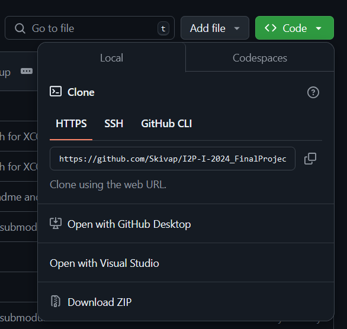

# Setting up project using CMake

This guide help you set up this project in Windows, MacOS and Linux using git, CMake and vcpkg. You can use any IDE you want, as long as it support CMake.

For Windows, I recommend [Visual Studio 2022](https://visualstudio.microsoft.com/thank-you-downloading-visual-studio/?sku=Community&channel=Release&source=VSLandingPage&cid=2029&workload=cplusplus)<br>
For [MacOS](https://code.visualstudio.com/docs/cpp/config-clang-mac) and [Linux](https://code.visualstudio.com/docs/cpp/config-linux), I recommend Visual Studio Code with [C/C++ extension pack](https://marketplace.visualstudio.com/items?itemName=ms-vscode.cpptools-extension-pack)<br>
I recommend not using Code::Blocks as it is really old and outdated.

If you are using Linux, I'll assume you've already know your thing 🐧

## Prequisites
### Installing git
It is important to use git to download this repository instead of download the zip file from the browser, so please install git if you don't have it.

#### Windows
Open Windows Powershell as Administrator and type in this code
```pwsh
winget install --id Git.Git -e --source winget
```
If the command above doesn't work, download git from [here](https://git-scm.com/downloads/win) and install manually. 
#### MacOS
Git is already bundled when you install Clang in the Visual Studio Code tutorial.

### Installing CMake
If you install Visual Studio 2022 through the link above or install Clang like in the Visual Studio Code tutorial, it came bundled with CMake.

## Setting up the project
### 1. Download the repository
Go to this repository main page, click Code and copy the link


Open a Terminal/Powershell at the target folder and type in the follow command, replacing ```<Copied-Url>``` with the link copied above.
```
git clone --recurse-submodules <Copied-Url>
```

### 2. Installing Allegro library
Run the ```setup_Windows.ps1``` or ```setup_MacOS_Linux.sh``` base on your operating system. This script will install Allegro library to the vcpkg included with this repo.

If the script ```setup_Windows.ps1``` crash right after opening, open Powershell as Administrator and type in the following command

```
Set-ExecutionPolicy Unrestricted
```
then press A.

### 3. Open and build project

Open the folder containing the ```CMakeLists.txt``` file in the code editor of your choice.

When using VS2022 or VSCode to open the folder, the project will be automatically configured and ready to run once done.

Build and run project by pressing ```F5``` in VS2022 or ```Shift+F5``` in VSCode.